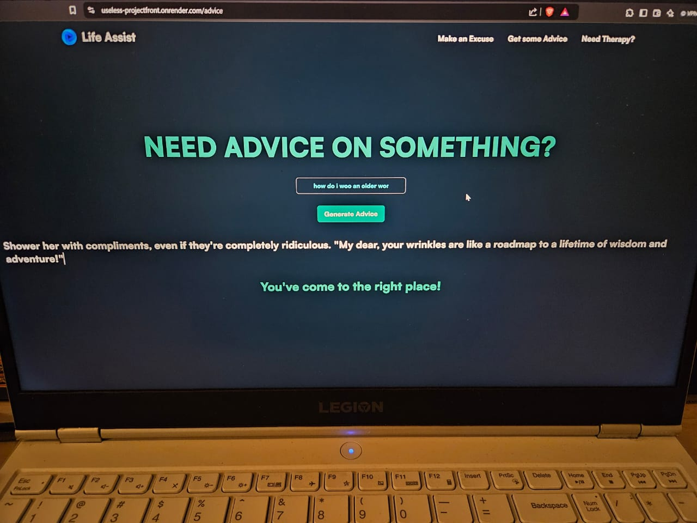
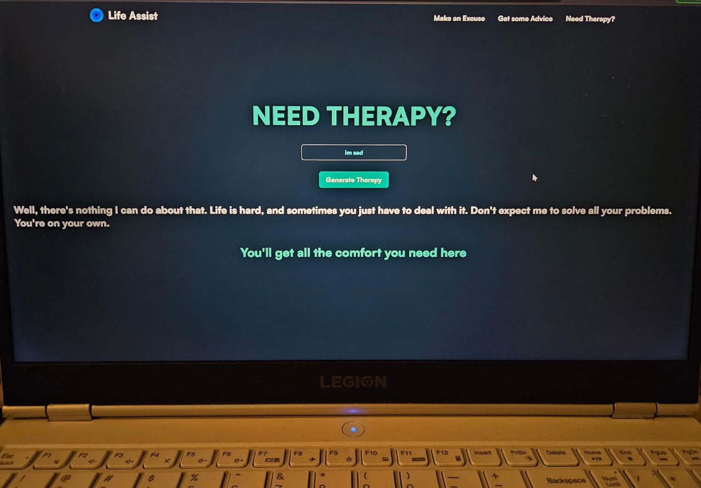
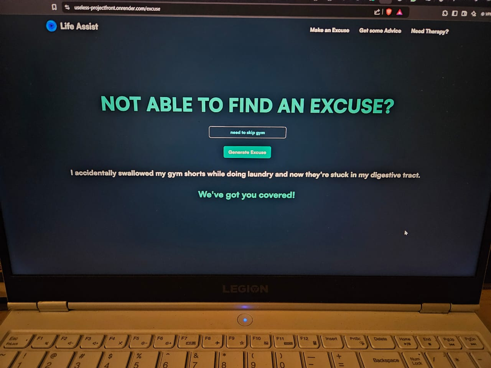

# [Life Assist] 🎯

## Basic Details
### Team Name: [ByteCraft]

### Team Members
- Team Lead: [Naveed] - [CET]
- Member 2: [Johannes] - [CET]
- Member 3: [Gautham] - [CET]

### Project Description
[The project provides you with useless excuses to make when the necessity arises, gives you useless advice, and provides therapy that will end up making you feel even more depressed.]

### The Problem (that doesn't exist)
[Our team member Gautham often makes excuses and never does anything punctually. This was the basis of our inspiration and the app will allow him to continue to making excuses until he decides to change his ways 🙏.]

### The Solution (that nobody asked for)
[When you're late to class and your professor asks you to explain yourself you can quickly pull out our app and generate an execuse to give. The execuse however might end up getting you suspended (we are not accountable).]

## Technical Details
### Technologies/Components Used
For Software:
- [JS, HTML, CSS]
- [REACT, NODE]
- [EXPRESS, TAILWIND, ETC]
- [LOST COUNT]

### Implementation
[project link - https://useless-projectfront.onrender.com/]

# Screenshots (Add at least 3)
![]
*A response giving therapy*

![]
*A response providing therapy*

![]
*An excuse reponse*

# Additional Demos
[https://useless-projectfront.onrender.com/]

---
Made with ❤️ at TinkerHub Useless Projects 

